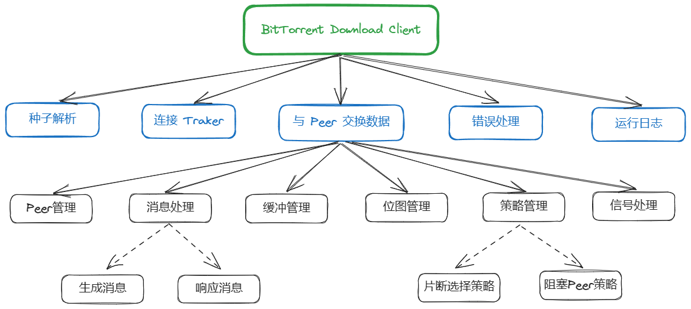
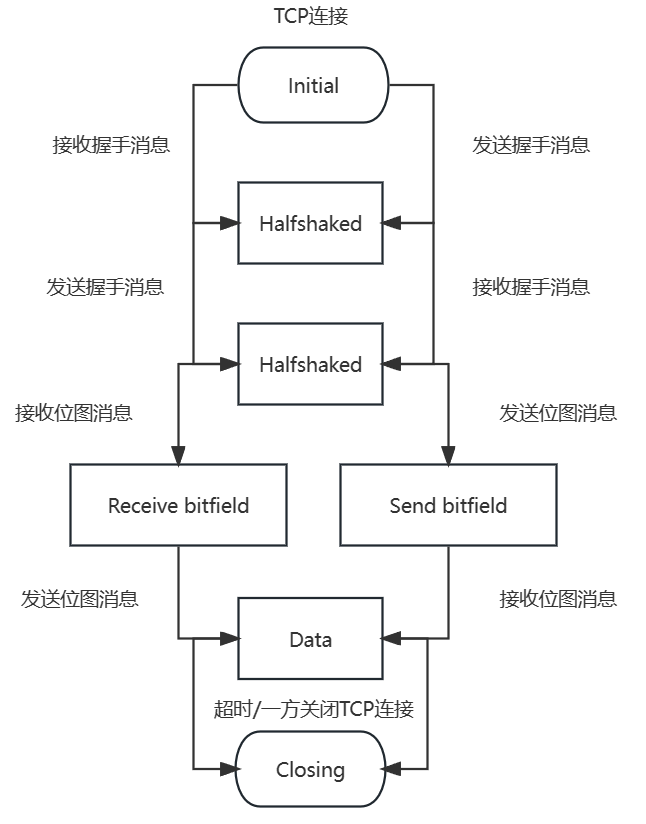
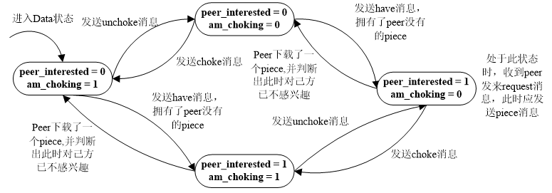

# BTdownload

## BT协议

BitTorrent协议，文件分发协议，每个下载者在下载的同时不断向其他下载者上传已经下载的数据。

FTP协议虽然下载服务相互独立，但是负责下载服务的服务器处理能力和带宽有限制。BT则是下载人数越多，下载速度越快（其充分利用了用户的上载带宽）。BT协议通过设计合适策略，保证上传速度与下载速度成正比。

## 系统结构

### 构成

1. Web服务器
   - 保存种子文件（metafile，.torrent后缀）：文件名、大小、Tracker 服务器地址
2. 种子服务器
3. Tracker服务器
   - 保存当前下载某个 被共享文件 的所有下载者的 IP 和 端口。
4. 原始文件（下载目标）提供者
   - 提供完整的 共享文件，使用 BT 客户端向外提供 种子文件。
5. 浏览器
6. 一个或者多个下载者
   - 通过 BT客户端 下载被共享的文件。
   - 某个下载者本身被称为一个 客户端，其他下载者被称为 Peer。

> 下载过程：
>
> 	1. 当前客户端解析种子；
> 	1. 当前客户端连接Tracker服务器，获取目标待下载文件的 所有下载者的IP 和 端口。
> 	1. 当前客户端从其他下载者下载被其他下载者下载的文件，同时向其他下载者提供当前客户端下载好的文件。

### 文件组织形式

共享文件：划分为 256KB（可设置为其它大小） 的 piece，每个 piece 由 Sha1 算法进行 hash 值计算，作为验证指纹（与种子文件中的值对比验证）。

Peer间文件传输，将 piece 划分为 16KB 大小的 slice 进行传输。

### 通信

客户端与 Tracker 间通过 HTTP 协议通信，Tracker作为Web服务器。

客户端 Peer 间通过 TCP 协议通信，一种被称为 Peer wire protocal 的连线协议。

种子文件和 Tracker 返回的信息，通过 B 编码方式编码。

### 模块

- 种子解析
- 位图管理
- 错误处理
- 运行日志
- 信号处理
- Peer管理
- 消息处理
- 缓冲管理
- 策略管理
- 连接 Tracker 模块
- 与 Peer 数据交换模块
- 主函数逻辑结构

#### 消息处理

Peer连接状态转换：

Peer通信下载逻辑：

Peer通信上传逻辑：

当am_interested = 1，peer_choking = 0时，也就是客户端对 Peer 感兴趣，而且 Peer 没有将客户端阻塞，发送request消息请求 Peer 发送数据， Peer 接收到请求后发送piece消息。

当peer_interested = 1，am_choking = 0时也就是 Peer 对客户端感兴趣，且客户端没有将该 Peer 阻塞。如果 Peer 发送request消息请求数据，则客户端应该构造并发送piece消息。

“发送unchoke/chock消息” 的时机是执行选择非阻塞 Peer 算法时，选中该 Peer 作为非阻塞 Peer 或者选中该 Peer 作为优化非阻塞 Peer 。

“发送have消息，拥有了 Peer 没有的piece” 的具体情况是：当己方刚刚下载到一个piece，此时通过发送have消息告知所有 Peer 客户端已拥有了某个piece，如果 Peer 没有这个piece且原先 Peer 对本客户端不感兴趣，则发送have消息后，该 Peer 就对该客户端感兴趣了。

#### 缓冲区设计

缓冲管理模块维护一个大小为16MB的缓冲区（大小可调整）。每个缓冲区结点的大小为16KB，默认生成1024个结点，总大小为16MB。缓冲区以一个piece（通常为256KB）为基本单位，也就是临近的16个结点为一组，这16个临近的结点要么全部被使用，要么全部空闲。为了方便处理，所有缓冲区在程序启动时统一申请，在程序结束时一起被释放。

缓冲管理模块将下载到的数据先保存在缓冲区中，在达到一定的数值时再将数据写入硬盘的文件中。

 Peer 请求数据时，先在缓冲区中寻找，若缓冲区中不存在所请求的数据，则从硬盘读文件并把请求数据所在的piece预先读入到缓冲区中。

设置缓冲区可以避免频繁读写硬盘，从而有利于保护硬盘。

除了管理缓冲区，本模块还负责：

- 创建待下载的文件
- 把下载到的piece写入文件
- 在 Peer 请求数据时读取文件

#### Tracker模块

主要任务是：

1. 构造HTTP请求，请求Tracker服务器发送peer的IP地址和端口号；
2. 与Tracker建立连接；
3. 解析从Tracker返回的数据。

Tracker返回的数据是经过 B 编码的，解析Tracker的回应和解析种子文件的过程是类似的。

#### 与 Peer 数据交换模块

- 与已建立连接的peer交换数据。

- 调用 Tracker模块 中定义的函数监视各个套接字，以及尝试与新的peer建立TCP连接。

## 算法策略

计算各个 Peer 的下载和上传速度，根据下载速度选择非阻塞 Peer ，采用随机算法选择优化非阻塞 Peer ，以及实现片断选择策略。

### 流水线作业

客户端向 Peer 发送请求时，一次请求多个 slice 。

### 片断选择算法

- 一个 piece 中的 slice 从同一个 Peer 处下载。
- 下载初期，随机选择要下载的 piece。
- 当多个客户端有一定数量的 piece 持有量，使用 最少优先 原则，先选择持有率较低的 piece 进行优先下载。
- 最后阶段，向所有 Peer 发送 piece 请求，从第一个返回 slice 数据的 Peer 处进行后续下载。

### 阻塞算法

Peer 一般与同时给予对方 上传 和 下载 服务的 Peer ，建立合作。对于不能建立合作关系的，就阻塞对方的连接，此 “阻塞” 是 临时拒绝上传，但是下载仍然继续。

从各个 Peer 处下载数据的速度是一个棘手的问题。经过分析和对比，通用的计算下载速度的方法是每10秒计算一次速度，统计最近10秒内从每个 Peer 处下载的数据量，然后除以时间，得到最近这段时间的下载速度。

然后，将下载速度最快的4个 Peer 解除阻塞，允许它们从本客户端下载。另外，除一个特殊的 Peer 外其他 Peer 将被阻塞。

这个特殊的 Peer 是为了发现更快下载速度的 Peer ，任何时刻保证存在一个优化非阻塞 Peer 。将这个 Peer 解除阻塞，而暂时不管从该 Peer 处下载数据的速度，每隔30秒重新进行选择。

在这30秒内，本客户端提供给该 Peer 较快的下载速度，然后该 Peer 将本客户端解除阻塞，这样就可以从该 Peer 处下载数据，并在下次选择非阻塞 Peer 时，该 Peer 能成为4个非阻塞 Peer 中的一个。

一旦某个 Peer 完成了下载，就生成一份 种子文件 的副本并上传到 Web 服务器。一个 Peer 要等到另一个 种子文件 上传到 Web服务器 之后，才能离开整个连接系统。

